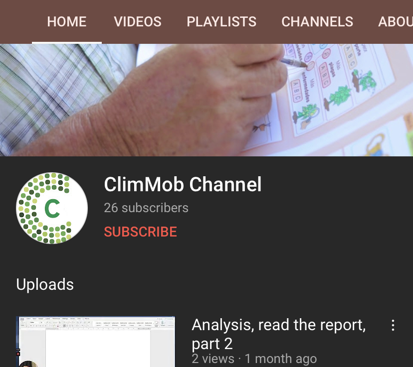

```{r setup, include=FALSE}
options(htmltools.dir.version = FALSE)
library("xaringanExtra")
htmltools::tagList(
  xaringanExtra::use_clipboard(
    button_text = "<i class=\"fa fa-clipboard\"></i>",
    success_text = "<i class=\"fa fa-check\" style=\"color: #90BE6D\"></i>",
    error_text = "<i class=\"fa fa-times-circle\" style=\"color: #F94144\"></i>"
  ),
  rmarkdown::html_dependency_font_awesome()
)
```


# Content


* Short introduction to R 
* Project-oriented workflow
* Introduction to Plackett-Luce model
* Turning *tricot* rankings into Plackett-Luce rankings
* Get data from ClimMob to R
* Visualization and summary
* Plackett-Luce Trees (model with covariates)
* Model selection 
* Q&A (organize with teams)

---
# Aim

Learn the principles to analyse the tricot data and how to interpret the results

---
# The tricot approach

Stands for "triadic comparison of technologies". A citizen-science approach with a combination of standardized formats, incomplete block design, simple data retrieval, farmer participation and digital tools

<center>

</center>

---
# The tricot approach

To know more, read the tricot short guide and watch our videos.

.pull-left[
<br>[Click here](https://hdl.handle.net/10568/109942) 
]

.pull-right[
<br>[Click here](https://www.youtube.com/channel/UCmqo4KCZwX8R-H4SNkXfuSA/playlists)
]


---
# **Thank you!**

.pull-left[

]

.pull-right[

[@desousakaue](https://twitter.com/desousakaue)

[k.desousa@cgiar.org](mailto:k.desousa@cgiar.org)
]


