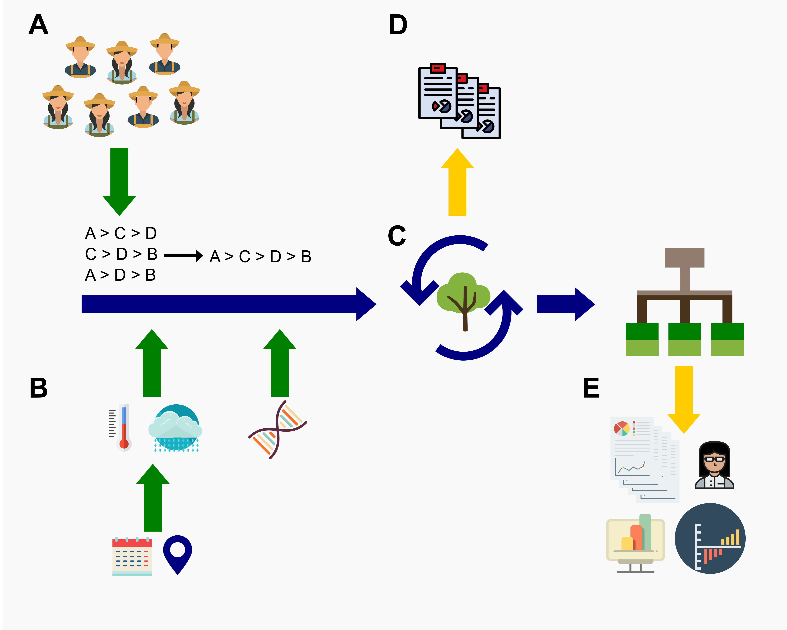

```{r setup, include=FALSE}
options(htmltools.dir.version = FALSE)
library("xaringanExtra")
htmltools::tagList(
  xaringanExtra::use_clipboard(
    button_text = "<i class=\"fa fa-clipboard\"></i>",
    success_text = "<i class=\"fa fa-check\" style=\"color: #90BE6D\"></i>",
    error_text = "<i class=\"fa fa-times-circle\" style=\"color: #F94144\"></i>"
  ),
  rmarkdown::html_dependency_font_awesome()
)
```


# Content

* Script vs Project
* RStudio project
* Directory structure
* Our workflow

# Lecture

This lecture is available on [Youtube](https://www.youtube.com/playlist?list=PLpT37wNlyZlS2QL67Qn-eLI8oETBr5sKm)

---
class: middle, inverse
# Script vs Project

---
# Script vs Project

## Script

* An R script is simply a text file containing a set of commands and comments. The script can be saved and used later to re-execute the saved commands
* Data analysis in a script-based approach means that you have to set your workplace every time that you need to work on the data
* Sometimes the input files are spread out in different directories and make difficult to others to reproduce the analysis. EVEN FOR YOU IF YOU CHANGE COMPUTER!!

.footnote[
[1] [Read more here](https://www.tidyverse.org/blog/2017/12/workflow-vs-script/)]

---
# Script vs Project

## Project

* A folder on your computer that holds all the files relevant to that particular piece of work
* Any resident R script is written assuming that it will be run from a fresh R process with working directory set to the project directory
* This convention guarantees that the project can be moved around on your computer or onto other computers and will still “just work”

.footnote[
[1] [Read more here](https://r4ds.had.co.nz/workflow-projects.html)]

---

.pull-left[

]

(**.Rproj**) a file generated by RStudio for the R project in this directory. This is the file that should be opened to work on the project (e.g. clean data, write scripts, write outputs)

(**data**) contains all the input files that are ready to be analysed. In some cases we use a sub-directory called "raw", which may contain some sensitive data and or the raw data

(**script**) contains all the scripts used for the analysis. They are named in order from 01 to `n` scripts. This makes easier for others to know where to start. Old scripts (not relevant for the analysis) are maintained in a sub-directory "old-scripts". You may need them in the future

(**output**) is where all the outputs from the analysis are written. 

(**manuscript**) an optional sub-directory to store the manuscript or report(s)


.footnote[
[1] [See this folder here](https://github.com/agrobioinfoservices/sweetpotato-cip-tricot) <br>
[2] [Read the paper by Moyo et al (2021) here](https://doi.org/10.3389/fsufs.2021.620363)
]

---
class: middle, inverse
# RStudio project

---
# RStudio project

Is a context for work on a specific project for data analysis

* automatically sets working directory to project folder
* has a separate workspace and command history
* its easy to share and ensure reproducibility

<center>

</center>

.footnote[
[1] [Read more here](https://r4ds.had.co.nz/workflow-projects.html#rstudio-projects)
]

---
# Our workflow

.pull-left[

]


(**A**) Several participants contribute with small tasks. Ranking-based approach allows the data to be easily combined.

(**B**) Explanatory covariates are added (e.g. using geographic coordinates and planting dates, or even DNA markers)

(**C**) Model selection to find the covariate(s) that best explain the data

(**D**) Automated reports can be generated and feedback to participants in (**A**) is given

(**E**) A stable *rpart* is used for further analysis

---
# R packages that we developed to support this workflow

.pull-left[

]

.pull-right[
[ClimMobTools](https://agrdatasci.github.io/ClimMobTools/) API Client for the ‘ClimMob’ platform in R

[gosset](https://agrdatasci.github.io/gosset/) Toolkit and a workflow to analyse metadata and experimental citizen science data

[PlackettLuce](https://hturner.github.io/PlackettLuce/) Functions to prepare rankings data and fit the Plackett-Luce model jointly attributed to Plackett (1975) and Luce (1959)

[chirps](https://docs.ropensci.org/chirps/) API Client for Climate Hazards Group InfraRed Precipitation with Station Data (CHIRPS)

[climatrends](https://agrdatasci.github.io/climatrends/) Methods to compute precipitation and temperature indices for climate models in ecology
]

---
# **Thank you!**

.pull-left[

]

.pull-right[

[@desousakaue](https://twitter.com/desousakaue)

[k.desousa@cgiar.org](mailto:k.desousa@cgiar.org)

<br><br><br><br><br><br><br><br><br><br>

[Back to the main page](index.html) 

]


