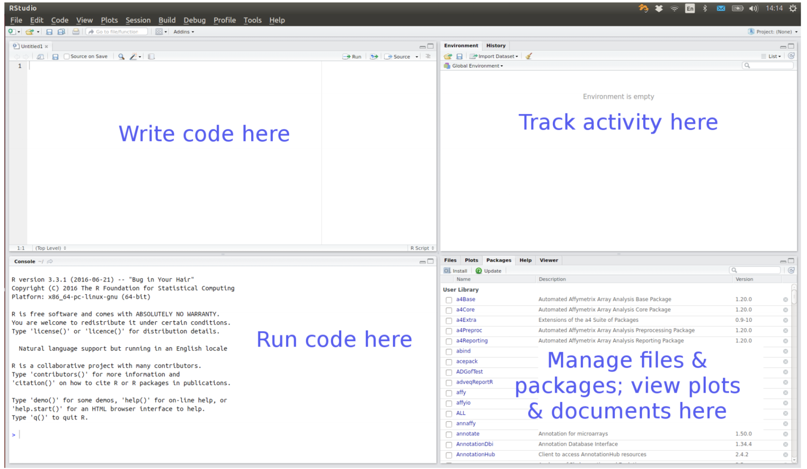
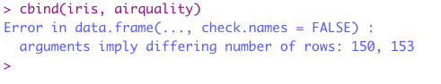
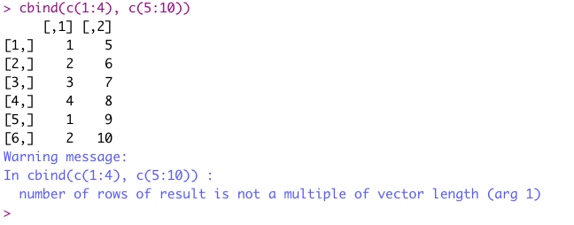
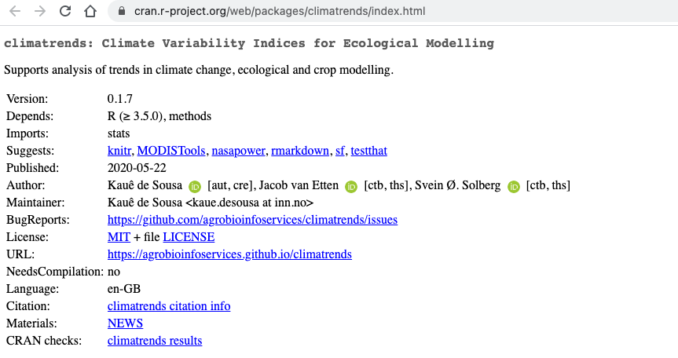
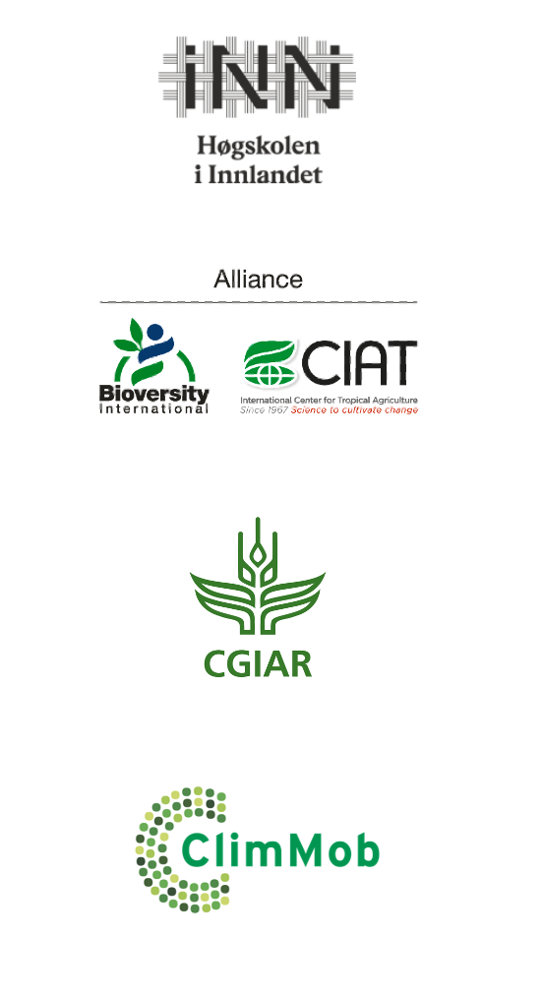

```{r setup, include=FALSE}
options(htmltools.dir.version = FALSE)
library("xaringanExtra")
htmltools::tagList(
  xaringanExtra::use_clipboard(
    button_text = "<i class=\"fa fa-clipboard\"></i>",
    success_text = "<i class=\"fa fa-check\" style=\"color: #90BE6D\"></i>",
    error_text = "<i class=\"fa fa-times-circle\" style=\"color: #F94144\"></i>"
  ),
  rmarkdown::html_dependency_font_awesome()
)
```

# Content

* R
* Data structures
* Creating objects and assigning values
* Indexing
* R packages
* Error and Warning messages
* Further reading and learning

# Lecture

This is lecture is available on [Youtube](https://www.youtube.com/playlist?list=PLpT37wNlyZlS2QL67Qn-eLI8oETBr5sKm)

---
class: middle, inverse
# R

---
# R

A free, open source programming language and software environment for statistical computing and graphics

Software for data science:

* experiment/survey design
* data retrieval
* data wrangling
* data analysis
* reporting

A programming language, so we can

* use existing functions to code up our data science tasks
* write new functions for customized/novel tasks

.footnote[
[1] [Click here to download R](https://cran.r-project.org/)]

---
# R code-along

We can type commands directly into the R console

```{r eval=FALSE, message=FALSE}
3 + 4
?"+" #look up help for "+"
x <- 3 + 4
y <- log(x)
ls() # list of objects in the current workspace
data() # find out what standard data sets there are
plot(iris) # plot Fisher's iris data
```

---
# RStudio

An integrated development environment for R

<center>

</center>

.footnote[
[1] [Click here to download RStudio](https://rstudio.com/products/rstudio/download/)]


---
class: middle, inverse
# Data structures

---
# Data structures

R is a vector based language

Data structures are the building blocks of code. In R there are four main types of structure:

* vectors
* matrices and arrays
* lists
* data frames

---
# Vectors

A single number is a special case of a numeric vector. Vectors of length greater than one can be created using the concatenate function `c()`.

The elements of the vector must be of the same type, common types are integer, numeric, character, factor and logical

```{r eval=FALSE, message=FALSE}
c(1, 2, 3) # an integer

c("red", "yellow", "green") # a vector with characters (strings)

c(TRUE, FALSE, TRUE) # a logical
```

R is a case sensitive language, for example, TRUE is different than true or True 

---
# Vectors

Elements of a vector are separated to each other with a comma 

```{r eval=FALSE, message=FALSE}
c(1, 4, 8)
```

Numbers are native elements and are recognised by R without the need of quotation mark " ". To assign strings (characters) to a vector you need to wrap each element with a quotation mark.

```{r eval=FALSE, message=FALSE}
c("apple", "banana", "orange", 1, 2)
```

---
# Missing values

Missing values (of any type) are represented by logical constant `NA`.

```{r eval=FALSE, message=FALSE}
c("apple", "banana", "orange", NA)
```

The first vector below is different from the second vector because the first have a length 3 (three elements inside the vector), while the last has a length 4 (four elements), even though the last element is non-available. We can check the length of a vector with the function `length()`

```{r}
length(c("apple", "banana", "orange"))

length(c("apple", "banana", "orange", NA))
```

---
# Missing values

The function `is.na()` helps in finding the `NA`s in a vector. The function returns a logical vector where `TRUE` indicates the `NA`s and `FALSE` the available element.

```{r}
is.na(c("apple", NA, "banana", "orange", NA))
```


---
# Lists

Lists are the R objects which contain elements of different types like numbers, characters, vectors or even another list inside it. List is created using list() function. And can contain elements of different lengths. 

Each vector larger than 1 is concatenated with the function `c()`

Each element in the list is separated to each other with a comma `,` 

```{r}
list(c(1, 2, 3, 4, 5),
     c("A", "B", "C", NA, "S"),
     TRUE)
```

---
# Data frames

A data frame is the most common way of storing data in R and, generally, is the data structure most often used for data analyses. In other words, a data frame is a list of equal-length vectors and can be created with the function `data.frame()`

```{r eval=TRUE, message=TRUE, echo=TRUE}
str(iris)
```

Here Species is a factor, a special data structure for categorical variables. 

Click [here](https://r4ds.had.co.nz/factors.html) to read more about factors.

---
# Creating a data frame

```{r eval=TRUE, message=TRUE, echo=TRUE}
data.frame(x = c(1:3),
           y = c(3:5),
           z = c("red", "blue", "black"),
           w = c(TRUE, FALSE, TRUE))
```

---
class: middle, inverse
# Creating objects and assigning values

---
# Creating objects and assigning values

Objects are assigned using `<-` , an arrow to the left formed out of `<` and `-`. An equal sign `=` can also be used. Creating objects is helpful because R keeps then in the "Global Environment" for subsequent utilization. 

```{r eval=TRUE, message=TRUE, echo=TRUE}
mydf <- data.frame(x = c(1:3),
                   y = c(3:5),
                   z = c("red", "blue", "black"),
                   w = c(TRUE, FALSE, TRUE))

mydf
```

---
# Some tips in creating objects and assigning values 

* Try to be objective and name your object clearly
* Don't use dots "." to separate name, as dots are used to parse [methods](http://adv-r.had.co.nz/S3.html) (which is an advanced topic)

```{r eval=FALSE, message=FALSE}
my_vector <- c("a", "y", "z") # good name

my.vector <- c("a", "y", "z") # not a good name
```

* Certain names should not be used to name objects (e.g. c, t, df, matrix, data), because these are names of functions in R. Type these on the Console and see what happens. Instead use, my_matrix, my_data, my_list or something similar.

---
class: middle, inverse
# Indexing

---
# Indexing

Indexing is a way to access the element(s) in an R object using its position in the vector. Indices in R starts with 1 (the first element in the vector) and goes until the value that represents the length of the vector.

```{r eval=TRUE, message=TRUE, echo=TRUE}
x <- c(3, 5, 6, 9, 10)

x[1] # access the element of position one

x[4:5] # access the elements four and five of the vector

x[c(2,4)] # access the elements two and four of the vector
```

Indexing can also be done with `match()`, `which()` and `%in%`, but this is a bit more advanced. Click [here](https://rafalab.github.io/dsbook/r-basics.html#indexing) to read more about it.

---
# Indexing a data frame

Data frames are objects with two dimensions. The first represents the rows and the second represents the columns.

```{r eval=TRUE, message=TRUE, echo=TRUE}
mydf[1] # take all the elements from the first column

mydf[1,] # take all the elements from the fist row

mydf[c(1,3), 3:4] # take the elements from rows one and three, and columns three and four

```

---
# Indexing a data frame

An element of a data frame can be also indexed using its column name (the safer choice!)

```{r eval=TRUE, message=TRUE, echo=TRUE}
# access column named x in mydf
# this returns a data frame with one column
mydf["x"] 

# dollar sign $ can be used to access elements inside a data frame or a list
# this returns a vector
mydf$x 

```

---
# Indexing a data frame

An element of a data frame can be also indexed using its column name (the safer choice!)

```{r eval=TRUE, message=TRUE, echo=TRUE}
# access lines one and two, and columns x and z in mydf
mydf[1:2, c("x", "z")] 

```

---
class: middle, inverse
# R packages

---
# R packages

A collection of R functions, complied code and sample data. They are stored under a directory called "library" in the R environment

Most day-to-day work will require at least one contributed package.

The Comprehensive R Archive Network [(CRAN)](https://cran.r-project.org/) is where most of the packages are

To install a package from CRAN we use the function `install.packages()`

```{r eval=FALSE, message=FALSE}
install.packages("ggplot2")
```

---
# R packages, developer version

Develop a R package is often an ongoing project. Once a package's version is stable enough, the developer publishes it on CRAN. 

Currently, most R packages under development are deposited on [GitHub](https://github.com/). To install a developing version from GitHub we use the function `install_github()` from the R package "remotes"

```{r eval=FALSE, message=FALSE}
install.packages("remotes")
remotes::install_github("agrdatasci/gosset")
```

---
# Library 

You just need to install a R package once. Unless you change the R version or change the location of the library

To call a package we use the function `library()`. This should be done every time that you start a new R section. Packages names can be wrapped with quotation marks or not. The [best practice](http://adv-r.had.co.nz/Computing-on-the-language.html#nse-downsides) is to use quotation marks.

```{r eval=FALSE, message=FALSE}
library("ggplot2")
library(gosset)
```

---
class: middle, inverse
# Error and Warning messages

---
# Error messages

An error occurs when we try to run a function but provide (in some way) the wrong input(s). By consenquence the object that we try to create is not generated and R returns an "error message".

```{r eval=FALSE, message=FALSE}
cbind(iris, airquality)
```
<center>

</center>

This error occurred because we tried to combine the data frames "iris" and "airquality" into a single object. But they have different dimensions (number of rows).

---
# Warning messages

R returns a warning message to keep you aware of an unexpected outcome of the function that can affect the object that is created.

```{r eval=FALSE, message=FALSE}
cbind(c(1:4), c(5:10))
```

<center>

</center>

This message warns us that we are combining two vectors with different lengths. The first has a length of four and the second a length of six. R runs the command, repeats the elements of index 1 and 2 from the first vector, and returns the matrix with a warnings message.

---
# Tips to deal with errors and warnings

Error and warning messages from native functions in R are often not so informative. But don't be afraid, most of them are, in some way, already reported on the web. Also the R community is very friendly and responsive. Here some tips:

* Don't panic and read carefully the error/warning message
* Copy the message and search for it on Google. Is very likely that you will find someone that went through the same error.
* [Stack Overflow](https://stackoverflow.com/) is where most of the errors are solved.
* On Twitter, look for help using the hashtag [#Rstats](https://twitter.com/search?q=%23Rstats&src=typed_query)
* Lastly, try to contact the package's developer through the channel informed in the package's home page on CRAN (BugReports).

<center>

</center>

---
R is a language with a steep learning curve. If you have no idea what you are doing, don't worry I also felt that way at the beginning. The tip is practice and look for help in the web forums.  

<center>

</center>

---
# Further reading and learning

## R Basics 

Professor Norman Matloff from UC Davis prepared "fasteR" a R tutorial for people with no background in coding. Read it here https://github.com/matloff/fasteR


## Advanced learning 

The 2nd Edition of "Advanced R" by Hadley Wickham provides great insights and exercises to improve your skills in R. Read it here https://adv-r.hadley.nz/index.html


The e-book "Introduction to Data Science" by Rafael A. Irizarry also provides great insights. Read it here https://rafalab.github.io/dsbook/

RStudio have a series of recorded webinars that can help you in learning more about R https://rstudio.com/resources/webinars/

---
# **Thank you!**

.pull-left[

]

.pull-right[

[@desousakaue](https://twitter.com/desousakaue)

[k.desousa@cgiar.org](mailto:k.desousa@cgiar.org)

<br><br><br><br><br><br><br><br><br><br>

[Back to the main page](index.html) 

]


