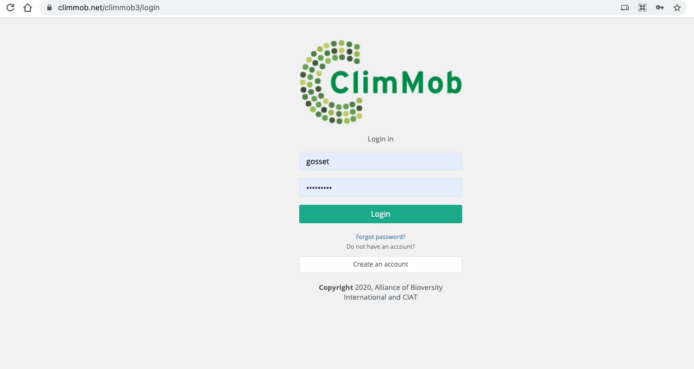

```{r setup, include=FALSE}
library("ClimMobTools")
options(htmltools.dir.version = FALSE)
library("xaringanExtra")
htmltools::tagList(
  xaringanExtra::use_clipboard(
    button_text = "<i class=\"fa fa-clipboard\"></i>",
    success_text = "<i class=\"fa fa-check\" style=\"color: #90BE6D\"></i>",
    error_text = "<i class=\"fa fa-times-circle\" style=\"color: #F94144\"></i>"
  ),
  rmarkdown::html_dependency_font_awesome()
)
```


# Content

* API key
* Project data
* Trial data

---
# Lecture

The lecture on this topic is given by Dr. Heather Turner as part of the eRum 2018 in Budapest. 

[Click here to watch the lecture]()

---
# Set up

For this lecture we need to package ClimMobTools. We install it from GitHub. You just need to run this command once.

```{r eval=FALSE, message=FALSE}
library("remotes")
install_github("agrdatasci/ClimMobTools", upgrade = "never")
```

Then we load the packages with `library()`. We run this command every time we open a new R section 

```{r eval=FALSE, message=FALSE}
library("ClimMobTools")
```

---
class: middle, inverse
# API key
---
# API key

Log-in into your ClimMob account at https://climmob.net/climmob3/login

<center>

</center>

---
# API key

Click on "Actions" and then "Profile" 

<center>

</center>

---
# API key

The API key is on the bottom of your profile information 

<center>

</center>

---
class: middle, inverse
# Project data
---
# Project data 

To access the information about your tricot projects we use the function `getProjectsCM()` from ClimMobTools, the main input is your API key

```{r}
key <- "d39a3c66-5822-4930-a9d4-50e7da041e77"

projects <- getProjectsCM(key)

projects[8:10, ]

```

---
# Project data 

If you are a client from an alternative ClimMob server, you may need the argument "server"

```{r eval=FALSE, message=FALSE}
key <- "your-key"
servername <- "server-name"

projects <- getProjectsCM(key, server  = servername)

```

---
class: middle, inverse
# Trial data
---
# Trial data

The trial data is retrieved with the function `getDataCM()`. We need the API key and the project id. Lets retrieve the data from the project "breadwheat"

This returns the data frame in a "tidy" format.

```{r}

dt <- getDataCM(key, project = "breadwheat")

dt[1:6, ]
```

.footnote[
[1] [Read more about tidy data](https://cran.r-project.org/web/packages/tidyr/vignettes/tidy-data.html)
]

---
# Trial data

To return the data in the wider format, we use the argument `pivot.wider = TRUE`

```{r}

dt <- getDataCM(key, project = "breadwheat", pivot.wider = TRUE)

dt[1:6, 1:5]
```


---
# **Thank you!**

.pull-left[

]

.pull-right[

[@desousakaue](https://twitter.com/desousakaue)

[k.desousa@cgiar.org](mailto:k.desousa@cgiar.org)
]


