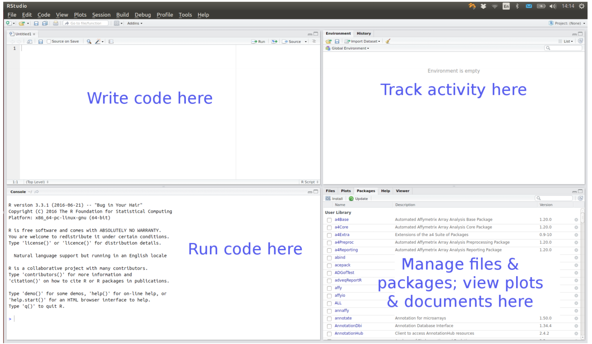

```{r setup, include=FALSE}
options(htmltools.dir.version = FALSE)
```


# Content


* Short introduction to R 
* Project-oriented workflow
* Get data from ClimMob into R
* Introduction to the Plackett-Luce model
* Turning *tricot* rankings into Plackett-Luce rankings
* Visualization and summary
* Plackett-Luce Trees (model with covariates)
* Model selection 
* Q&A (organize with teams)

---
# Aim

Learn the principles to analyse the tricot data and how to interpret the results

---
class: middle, inverse
# Short introduction to R

---
# Why R

Free and open source$^1$.

Software for data science:

* experiment/survey design
* data retrieval
* data wrangling
* data analysis
* reporting

A programming language, so we can

* use existing functions to code up our data science tasks
* write new functions for customized/novel tasks

.footnote[
[1] [Download here](https://cran.r-project.org/)]

---
# R code-along

We can type commands directly into the R console

```{r eval=FALSE, message=FALSE}
3 + 4
?"+" #look up help for "+"
x <- 3 + 4
y <- log(x)
ls() # list of objects in the current workspace
data() # find out what standard data sets there are
plot(iris) # plot Fisher's iris data
```

---
# RStudio

<center>

</center>

.footnote[
[1] [Download here](https://rstudio.com/products/rstudio/download/)]
---
# Data structures

R is a vector based language

Data structures are the building blocks of code. In R there are four main types of structure:

* vectors
* matrices and arrays
* lists
* data frames

---
# Vectors

A single number is a special case of a numeric vector. Vectors of length greater than one can be created using the concatenate function `c()`.

The elements of the vector must be of the same type: common types are integer, numeric, character, factor and logical

```{r eval=FALSE, message=FALSE}
c(1,2,3)

c("red", "yellow", "green")

c(TRUE, FALSE, TRUE)
```

R is a case sensitive language, for example, TRUE is different than true or True 

---
# Vectors

Elements of a vector are separated to each other with a comma 

```{r eval=FALSE, message=FALSE}
c(1, 4, 8)
```

Numbers are native elements and are recognised by R without the need of quotation mark " ". To assign strings (characters) to a vector you need to wrap each element with a quotation mark.

```{r eval=FALSE, message=FALSE}
c("apple", "banana", "orange", 1, 2)
```

Logical constants can be coerced to integers where `TRUE` becomes `1` and `FALSE` becomes `0`. For this we use the function `as.integer()`

```{r eval=FALSE, message=FALSE}
as.integer(c(TRUE, FALSE, FALSE, TRUE))
```

---
# Missing values

Missing values (of any type) are represented by logical constant `NA`.

```{r eval=FALSE, message=FALSE}
c("apple", "banana", "orange", NA)
```

The first vector below is different from the second vector because the first have a length 3 (three elements inside the vector), while the last has a length 4 (four elements), even though the last element is non-available. We can check the length of a vector with the function `length()`

```{r eval=FALSE, message=FALSE}
length(c("apple", "banana", "orange"))

length(c("apple", "banana", "orange", NA))
```

---
# R packages

A collection of R functions, complied code and sample data. They are stored under a directory called "library" in the R environment

Most day-to-day work will require at least one contributed package.

The Comprehensive R Archive Network [(CRAN)](https://cran.r-project.org/) is where most of the packages are

To install a package from CRAN we use the command

```{r eval=FALSE, message=FALSE}
install.packages("ggplot2")
```


In this example, we used the native R function `install.packages()` to install the package "ggplot2".

---
# R packages, developer version

Develop a R package is often an ongoing project. Once a package's version is stable enough, the developer published it on CRAN. 

Currently, most R packages under development are deposited on [GitHub](https://github.com/). To install a developing version from GitHub we use the command

```{r eval=FALSE, message=FALSE}
install.packages("remotes")
remotes::install_github("agrobioinfoservices/gosset")
```

In this example we used the function `install_github()` from the R package "remotes" to install the R package "gosset"

---
# Error messages

Error messages from native functions in R are often not so informative. 
